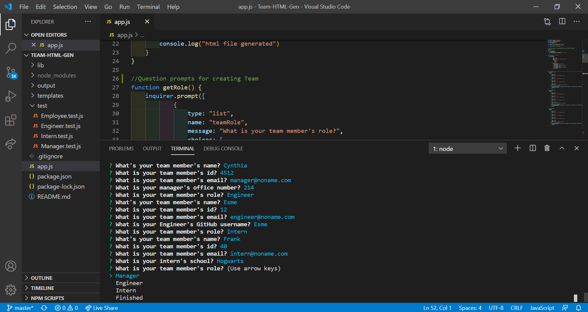
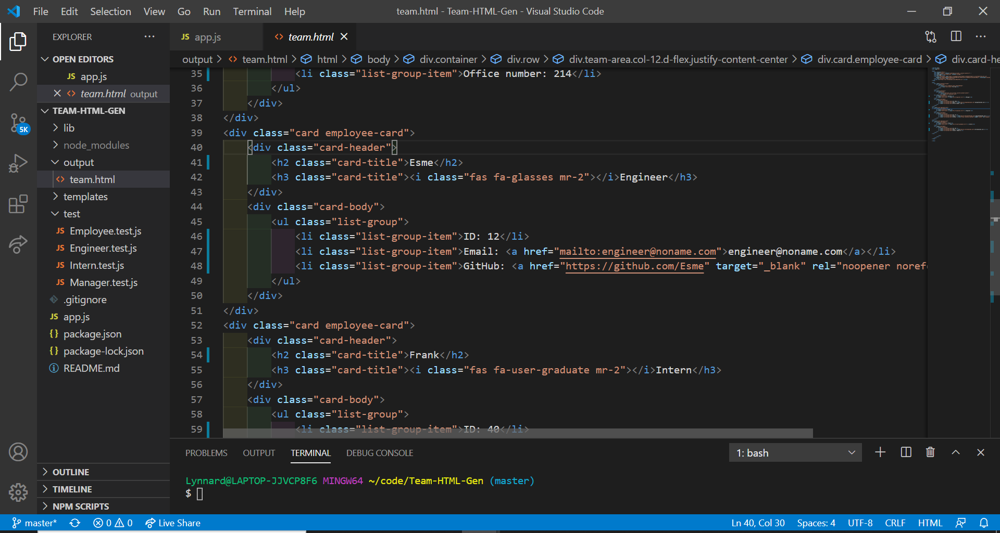
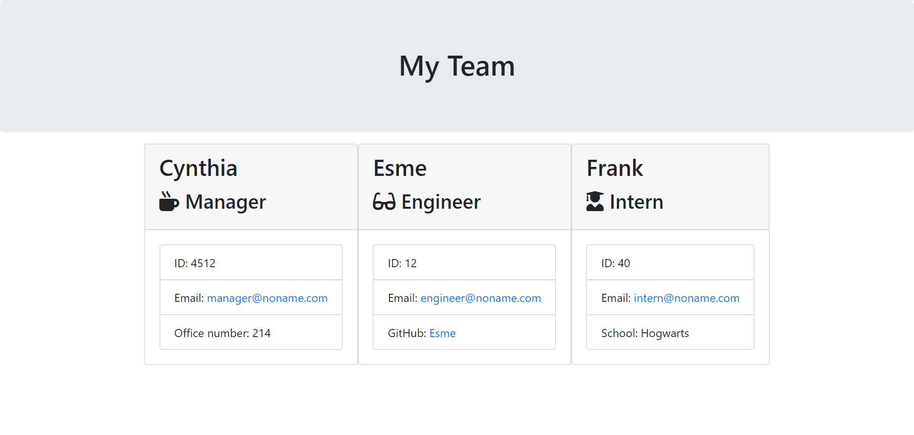

# Team-HTML-Gen
A Node CLI that takes in information about employees and generates an HTML webpage that displays summaries for each person.

## Author

Heather Stolz (Wanderingtech)

## License

This project is protected under the BSD license.
   

## Table of Contents:

* [Description](#description)
* [Installation](#installation)
* [Usage](#usage)
* [Tests](#tests)
* [Links](#links)
* [Questions](#questions)

## Description

 A software engineering team generator command line application. The application prompts the user for information about the team manager and then information about the team members. The user inputs any number of team members, and they may be a mix of engineers and interns. When the user has completed building the team, the application will create an HTML file that displays a nicely formatted team roster based on the information provided by the user. 
 This project passes all unit tests. 

## Installation

Please run these commands to install dependancies for this project: npm i

## Usage

To quickly build an engineering team HTML file.

## Tests

npm run test

## Links/Images

## Questions

If you have any questions regarding this project, you can find me at [Wanderingtech](https://github.com/Wanderingtech) 

and/or at heather86lyn@gmail.com.